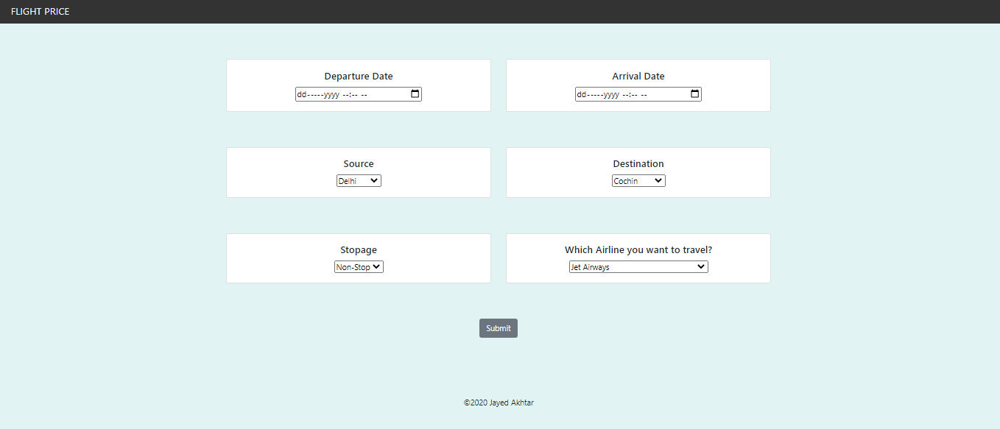
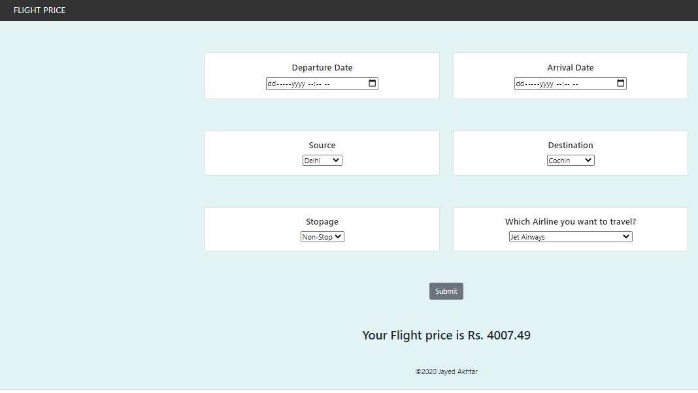

 # Flight Fare prediction
 ## Overview
This is a Flask web app which predicts fare of Flight ticket.This project is tested over ml model RandomForest and it perform well with r2 value of 0.811


## Some screenshots of the app
* Landing Page:


 Predictor:


## Technologies Used


[](https://flask.palletsprojects.com/en/1.1.x/) [](https://gunicorn.org) [](https://scikit-learn.org/stable/) 

## Directory Tree 
```
├── static 
│   ├── css
├── template
│   ├── home.html
├── Procfile
├── README.md
├── app.py
├── flight_price.ipynb
├── flight_rf.pkl
├── requirements.txt
```
## How to run this app
* First create a virtual environment by using this command:
* conda create -n myenv python=3.6
* Activate the environment using the below command:
* conda activate myenv
* Then install all the packages by using the following command
* pip install -r requirements.txt
* Now for the final step. Run the app
* python app.py
